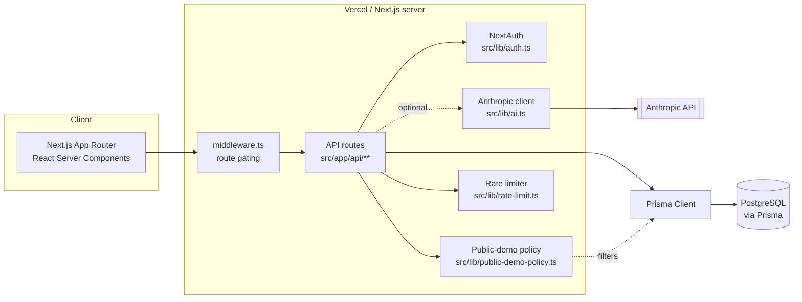

# Abrahamic Scripture Comparison

[](https://abrahamic.vercel.app)

**Live demo:** https://abrahamic.vercel.app — production deploys on merge to `main` via Vercel. See [`docs/CI_STATUS.md`](docs/CI_STATUS.md) and [`docs/REVIEWER_GUIDE.md`](docs/REVIEWER_GUIDE.md).

A web application for side-by-side comparison of texts across the Abrahamic scriptures — Torah, Bible, and Quran — with thematic search, verse alignment, and commentary layers.

## What It Does

- Browse and search across Torah, Bible, and Quran in parallel
- Thematic and keyword-based verse alignment across traditions
- Clean reading interface with side-by-side scripture views
- Figures, family tree, concepts, and a cross-tradition timeline
- **For Kids** (`/kids`) — age-banded stories and four keyboard-accessible games
- **Videos** (`/videos`) — editor-selected background material, privately embedded
- Prisma-backed data layer for structured scripture storage

## Status

> **Public engineering demo** at https://abrahamic.vercel.app — showcases the full platform (figures, themes, comparisons, timeline, search, admin) with **original Hebrew/Arabic text and project-authored reader notes only** — no licensed English translations. See [`docs/LICENSING.md`](docs/LICENSING.md).

This is a structured editorial and software-engineering case study. It does not claim theological authority, and AI-generated suggestions are never published without an explicit editorial approval step.

Claims use an auditable editorial workflow (`DRAFT → IN_REVIEW → PUBLISHED → ARCHIVED`). Public API callers can retrieve published material only; authenticated editors may prepare and submit drafts, while publication, archival, and deletion remain administrator actions.

For the role and audit walkthrough, use the [90-second demo](docs/90_SECOND_DEMO.md) or [three-minute reviewer path](docs/RECRUITER_DEMO.md).

## Public demo policy (no publisher licenses)

| On public deploy | Not shown |
|------------------|-----------|
| Full platform: figures, themes, comparisons, claims, search | Any third-party English translation |
| Original Hebrew / Arabic text | JPS, KJV, ESV, Yusuf Ali, Sahih International |
| **Reader note (original)** — English context written for this demo | |

Defined in `src/lib/public-demo-policy.ts` and **enforced at the Prisma client
layer** (`src/lib/queries/translation-guard.ts`): a client extension strips
non-public translations from every query result at any nesting depth, so a new
query cannot bypass the policy by omitting a filter. Set `PUBLIC_DEMO_MODE=false`
for a deployment that holds real translation licences. See
[`docs/LICENSING.md`](docs/LICENSING.md).

## Kids section

`/kids` carries stories and games written for two age bands (6–8, 9–12). Three
properties hold by construction rather than by convention:

- **Nothing reaches a child unreviewed.** Drafts are generated from *published*
  claims into a PENDING queue, and approval and publication are separate admin
  actions. A database CHECK constraint (`kids_stories_publish_requires_approval`)
  rejects publishing anything not approved, so no code path can skip the review.
- **Licensed text cannot reach a story.** The generator receives claim
  statements and verse *references* only; the route selects no translations at
  all. `src/lib/kids/content-guard.ts` then re-checks every draft
  deterministically — licensed names, quoted spans, evaluative language,
  second-person religious instruction, distressing content, prophet depiction,
  missing attribution, and reading level — before it is stored.
- **No child data is collected.** Game progress lives in one localStorage key.
  No accounts, cookies, network calls, or name fields, which keeps the section
  outside COPPA and GDPR Article 8 scope. A test asserts the stored object's
  exact shape so an identifier cannot be added silently.

Games derive from existing reviewed data (`FigureAlias`, `TimelineEvent`,
`TimelineEventTradition`, `FigureRelation`), so none asserts anything new.

## Videos

Third-party videos are the one place outside voices appear. Each is added
individually by an editor — no search, no channel import — with a required
`editorNote` explaining the selection, and every embed carries a visible
"inclusion is not endorsement" line. Videos never appear on comparison pages.

`src/components/video/YouTubeFacade.tsx` issues **no request to Google until the
viewer clicks** — including no `i.ytimg.com` thumbnail, which would defeat the
purpose. Playback then loads `youtube-nocookie.com` with no autoplay. Video ids
are regex-validated at write and render time, since they are interpolated into
an iframe URL.

## Screenshots

The live demo is the fastest way to see the app — a home page, side-by-side comparison view, timeline, and family tree. See it at [abrahamic.vercel.app](https://abrahamic.vercel.app), or the [`docs/REVIEWER_GUIDE.md`](docs/REVIEWER_GUIDE.md) for a guided tour.

## Architecture



- **Data model**: Figures, sources, verses, translations, claims, comparisons, themes, and timeline events, all Prisma-modeled with checked-in migrations (`prisma/migrations`).
- **Public-demo boundary**: `src/lib/public-demo-policy.ts` filters every translation the API returns so the public deployment never serves licensed English text — enforced in code and covered by tests, not just documentation.
- **AI layer is optional and additive**: search ranking and comparison summaries call the Anthropic API only when `ANTHROPIC_API_KEY` is set; the app works without it.

## Engineering Scope

- Next.js App Router frontend with responsive comparison and editorial workflows
- PostgreSQL/Prisma data model with checked-in migrations
- NextAuth administration boundary, enforced in middleware, layout, and every
  mutating route handler
- Content policy enforced at the data-access layer, not per call site
- Vitest suite (126 tests) covering the content policy, the admin boundary
  across every mutating route, the kids content guard, embed-id validation, and
  component keyboard/ARIA behaviour
- CI validation for migrations, TypeScript, ESLint, tests, and production builds

## Stack

| Layer | Technology |
|---|---|
| Framework | Next.js 16 (App Router) |
| Language | TypeScript |
| Database | PostgreSQL via Prisma ORM |
| Styling | Tailwind CSS |
| Runtime | Node.js 24 |

## Project Structure

```
.
├── src/
│   ├── app/        # Next.js App Router pages (incl. /kids, /videos, /admin)
│   ├── components/ # UI components (ui/, kids/, video/, admin/, …)
│   ├── lib/
│   │   ├── queries/  # translation-guard: content policy enforcement
│   │   ├── kids/     # content-guard, readability, localStorage progress
│   │   └── schemas/  # shared zod schemas
│   └── middleware.ts # edge admin gate (must live in src/, not the repo root)
├── prisma/         # Schema, migrations, and seed modules
├── tests/          # Vitest: lib/, api/, components/
├── public/         # Static assets
```

## Getting Started

For the complete deterministic demonstration, run `docker compose up --build` and open
`http://localhost:3000`. The app waits for PostgreSQL, applies migrations, and idempotently
seeds the licensed sample corpus.

```bash
docker compose up -d          # Postgres on host port 5434
cp .env.example .env
npm install
npx prisma migrate deploy
npm run db:seed
npm run dev
```

Open [http://localhost:3000](http://localhost:3000).

## Tests

```bash
npm run test:run
```

126 tests, no database required — Prisma is mocked. `DATABASE_URL` must still be
set, because importing `@/lib/prisma` constructs the adapter at module load.

## Environment Variables

Copy `.env.example` to `.env`. Note that `docker-compose.yml` maps Postgres to
host port **5434**, not 5432.

| Variable | Purpose |
|---|---|
| `DATABASE_URL` / `DIRECT_URL` | Postgres connection (runtime / migrations) |
| `NEXTAUTH_SECRET` / `NEXTAUTH_URL` | Session signing and callback origin |
| `ADMIN_EMAIL` / `ADMIN_PASSWORD_HASH` | Single-admin credentials; the hash is bcrypt |
| `ANTHROPIC_API_KEY` | Admin AI tools; those routes return 503 without it |
| `PUBLIC_DEMO_MODE` | Defaults to on; `false` disables translation filtering |

## Deployment (Vercel)

GitHub CI validates migrations and production builds against Postgres. Vercel builds use `prisma generate && next build` (see `vercel.json`) so deploys do not require database connectivity at build time.

For a no-cost setup, use Vercel's Hobby plan with a free Neon Postgres project. The app also supports legacy `PRISMA_DATABASE_URL` / `POSTGRES_URL` variables and maps them to Prisma's `DATABASE_URL` at runtime (see `src/lib/prisma-env.ts`).

1. Create a free Neon Postgres database and set its pooled URL as `DATABASE_URL` and direct URL as `DIRECT_URL` in the Vercel project.
2. Set `NEXTAUTH_URL` to your production URL (e.g. `https://abrahamic.vercel.app`) for auth callbacks and Open Graph metadata.
3. Run `npm run db:deploy` against that database.
4. Run `npm run db:seed` to load license-free demo content.
5. Redeploy if needed.

```bash
vercel env run --environment production -- npm run db:deploy
vercel env run --environment production -- npm run db:seed
```

## License

Project source code is [MIT licensed](LICENSE). The **public demo** uses original-language text and **original reader notes** only — no licensed translations, and the MIT license does not extend to any third-party scripture translation text. See [`docs/LICENSING.md`](docs/LICENSING.md).

**15-minute review:** [`docs/REVIEWER_GUIDE.md`](docs/REVIEWER_GUIDE.md) · **Live demo:** [abrahamic.vercel.app](https://abrahamic.vercel.app)
